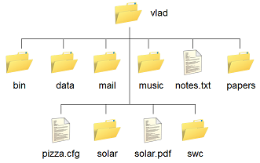
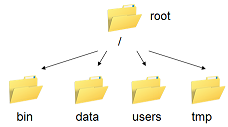

 


## <h2 align="center"><span style="color:orange;">                   `Basic Linux Shell Commands`        </span></h2>


## <center> <b> <span style="color:orange;" >  `What Is Linux? ` </span> </b></center>


An operating system (OS), in its most general sense, is software that allows a user to run other applications on a computing device. An Operating is made of many components, but its two prime components are:

    - Kernel
    - Shell

 
 


**Linux** is an operating system's kernel. You might have heard of *UNIX*. Well, Linux is a UNIX clone. But it was actually created by Linus Torvalds from Scratch. Linux is free and open-source, that means that you can simply change anything in Linux and redistribute it in your own name! There are several Linux Distributions, commonly called “distros”.

    - Ubuntu Linux
    - Red Hat Enterprise Linux
    - Linux Mint
    - Debian
    - Fedora
    
 ##   Linux Shell or “Terminal”    
 
Basically, a shell is a program that receives commands from the user and gives it to the OS to process, and it shows the output. Linux's shell is its main part. Its distros come in GUI (graphical user interface), but basically, Linux has a CLI (command line interface).

A *shell* in a Linux operating system takes input from you in the form of commands, processes it, and then gives an output. It is the interface through which a user works on the programs, commands, and scripts. A shell is accessed by a terminal which runs it. A *terminal* is a program you run that gives you access to the
shell. There are many different terminal programs that vary across operating systems.


There are many reasons to learn about the shell. The most important
reasons are that: 

1.  It is very common to encounter the shell and
    command-line-interfaces in scientific computing, so you will
    probably have to learn it eventually 

2.  The shell is a really powerful way of interacting with your
    computer. GUIs and the shell are complementary - by knowing both
    you will greatly expand the range of tasks you can accomplish with
    your computer. You will also be able to perform many tasks more
    efficiently.
    

The shell is just a program and there are many different shell programs that have been developed. The most common shell (and the one we will use) is called the **Bourne-Again SHell (bash)**. Even if bash is not the default shell, it is usually installed on most systems and can be started by typing `bash` in the terminal. Many commands, especially a lot of the basic ones, work across the various shells but many things
are different. I recommend sticking with bash and learning it well.
[Here is a link for more information](http://en.wikipedia.org/wiki/Bash_(Unix_shell).


So as you are considering using Linux, learning basic command lines will go a long way. In this tutorial, you’ll learn some basic Linux commands that will undoubtedly help you navigate through Linux as a newbie, we shall learn them in the shell of Linux.  

## Let's get started--Basic Commands

Before we go on to the list of commands, you need to open the command line first. If you are still unsure about the command-line interface, check out this [CLI tutorial](https://www.hostinger.com/tutorials/what-is-cli).

To open the terminal, press: `Ctrl+Alt+T`


## <center> <b> <span style="color:red;"> Commands are case sensitive </span> </b></center>


## The Example: Manipulating Experimental Data Files

We will spend most of our time learning about the basics of the shell
by manipulating some experimental data from a hearing test. To get
the data for this test, you will need internet access. Just enter the
command:

    git clone https://github.com/gabayae/friendly-shell-lesson.git shell-lesson

Followed by:

    cd shell-lesson

These 2 commands will grab all of the data needed we'll need.

One very basic command is `echo`. This command just prints text to
the terminal. Try the command:

    echo "Hello, World"

Then press enter. You should see the text "Hello, World" printed back to you. The `echo` command is useful for printing from a shell script, for displaying variables, and for generating known values to pass
to other programs.

### Moving around the file system

Let's learn how to move around the file system using command line
programs. This is really easy to do using a GUI (just click on
things). Once you learn the basic commands, you'll see that it is
really easy to do in the shell too. 




#### 1. `pwd`

First we have to know where we are. The program `pwd` (print working
directory) tells you where you are sitting in the directory tree. Use the `pwd` command to find out the path of the current working directory (folder) you are in. The command will return an absolute (full) path, which is basically a path of all the directories that starts with a forward slash (/). An example of an absolute path is */home/username*.


```python
!pwd 
```

    /home/yugaba/My_Courses/Py-SciComp-SoftEng/AIMS-Sen-2021-2022/shell-lesson


Note: The `tree` command can be useful for visualization purpose,  it will list contents of directories in a tree-like format. 


```python
!tree
```

    .
    ├── 00-Basic-Linux-Commands.html
    ├── 00-Basic-Linux-Commands.ipynb
    ├── aimssn_logo.png
    ├── appaloosa.txt
    ├── data.zip
    ├── dictionary.txt
    ├── filesystem.png
    ├── linux-pic.jpeg
    ├── OS.png
    └── vlad_homedir.png
    
    0 directories, 10 files


#### 2. `ls`
The command `ls` will list the files in files in the current
directory (pwd). Directories are often called **folders** because of how theyare represented in GUIs. Directories are just listings of files. They can contain other files or directories.

 Note:

    - Directories are denoted in blue color .
    - Files are denoted in white.
    - You will find similar color schemes in different flavors of Linux.

If you want to see the content of other directories, type ls and then the directory's path. For example, enter `ls /home/username/Documents` to view the content of `Documents`.

Some terminals will not color the directory entries in this very convenient way. In those terminals, use `ls -F` instead of `ls`. The `-F` argument modifies the results so that a slash is placed at the end of directories. If the file is *executable* meaning that it can be run like a program, then a star will be placed at the end of of the
file name.   

There are variations you can use with the `ls` command:

   1. `ls -R` will list all the files in the sub-directories as well
   2. `ls -a` will show the hidden files
   3. `ls -al` will list the files and directories with detailed information like the permissions, size, owner, etc.


```python
!ls
```

    00-Basic-Linux-Commands.html   appaloosa.txt   filesystem.png  vlad_homedir.png
    00-Basic-Linux-Commands.ipynb  data.zip        linux-pic.jpeg
    aimssn_logo.png		       dictionary.txt  OS.png


#### 3. `whoami`
Whenever you start up a terminal, you will start in a special directory called the *home* directory. Every user has their own home directory where they have full access to do whatever they want. For example, if our user ID is `me`, the `pwd` command tells us that we are in the `/home/me` directory. This is the home directory for the `me` user. That is our user name. You can always find out your user name by entering the command `whoami`.


```python
!whoami
```

    yugaba


#### 4. `cd` 
To navigate through the Linux files and directories, use the `cd` command. It requires either the full path or the name of the directory, depending on the current working directory that you’re in.
For example, if you are in the `/home` folder, and you want to go to the `/Downloads` folder, then you can type in `cd Downloads`. Remember, this command is case sensitive, and you have to type in the name of the folder exactly as it is.
Let's say you are in `/home/username/Documents` and you want to go to `Photos`, a subdirectory of `Documents`. To do so, simply type the following command: `cd Photos`.

Another scenario is if you want to switch to a completely new directory, for example,`/home/username/Movies`. In this case, you have to type cd followed by the directory's absolute path: `cd /home/username/Movies`.

##### Full vs. Relative Paths

The `cd` command takes an argument which is the directory
name. Directories can be specified using either a *relative* path a
full *path*. The directories on the computer are arranged into a
hierarchy. The absolute path tells you where a directory is in that
hierarchy. Navigate to the home directory. Now, enter the `pwd`
command and you should see something like:

    /home/me

which is the full name of your home directory. This tells you that you
are in a directory called `me`, which sits inside a directory called
`home` which sits inside the very top directory in the hierarchy. The
very top of the hierarchy is a directory called `/` which is usually
referred to as the *root directory*. So, to summarize: `me` is a
directory in `home` which is a directory in `/`.



Now navigate to the folder `shell-lesson` folder

    cd path_to/ .../shell-lesson

This jumps to `shell`. Now go back to the home directory. We saw
earlier that the command:

    cd path_to/.../shell-lesson

had the same effect - it took us to the `shell-lesson` directory. But, instead of specifying the absolute path
(`/home/..../shell-lesson`), we specified a *relative path*. In other words, we specified the path relative to our current directory. A absolute path always starts with a `/`. A relative path does not. You can usually use either a absolute path or a relative path depending on what is most convenient. If we are in the home directory, it is more convenient to just enter the relative path since it involves less typing.

#### 5. `mkdir` & `rmdir` 
Use the `mkdir` command when you need to create a folder or a directory. For example, if you want to make a directory called ``MyFirstDirectory``, then you can type `` mkdir MyFirstDirectory``. 
If you type `mkdir MyMusic`, it will create a directory called `MyMusic`.


```python
!mkdir MyMusic
```


```python
# You can check that the folder has indeed been created.
!ls
```

    00-Basic-Linux-Commands.html   appaloosa.txt   filesystem.png  OS.png
    00-Basic-Linux-Commands.ipynb  data.zip        linux-pic.jpeg  vlad_homedir.png
    aimssn_logo.png		       dictionary.txt  MyMusic


We can see that a new folder, named `MyMusic` has been created. 

Use `rmdir` to delete a directory. But ``rmdir`` can only be used to delete an empty directory. 


```python
!rmdir MyMusic
```


```python
# You can check that the folder has indeed been deleted.
!ls
```

    00-Basic-Linux-Commands.html   appaloosa.txt   filesystem.png  vlad_homedir.png
    00-Basic-Linux-Commands.ipynb  data.zip        linux-pic.jpeg
    aimssn_logo.png		       dictionary.txt  OS.png


We can see that the new folder, named `MyMusic` has been deleted. 

#### 6. `touch`  &` rm`
Lets create an empty file using the `touch` command. Enter the
command:

    touch testfile

Then list the contents of the directory again. You should see that a
new entry, called `testfile`, exists. It is colored white meaning that
it is a file, as opposed to a directory. The `touch` command just
creates an empty file. 


```python
!touch testfile
```


```python
!ls
```

    00-Basic-Linux-Commands.html   appaloosa.txt   filesystem.png  testfile
    00-Basic-Linux-Commands.ipynb  data.zip        linux-pic.jpeg  vlad_homedir.png
    aimssn_logo.png		       dictionary.txt  OS.png


```python
!tree
```

    .
    ├── 00-Basic-Linux-Commands.html
    ├── 00-Basic-Linux-Commands.ipynb
    ├── aimssn_logo.png
    ├── appaloosa.txt
    ├── data.zip
    ├── dictionary.txt
    ├── filesystem.png
    ├── linux-pic.jpeg
    ├── OS.png
    ├── testfile
    └── vlad_homedir.png
    
    0 directories, 11 files


Now, let's get rid of `testfile`. To remove a file, just enter the
command:

    rm testfile

The `rm` command can be used to remove files. If you enter `ls` again,
you will see that `testfile` is gone.


```python
!rm testfile
```


```python
!ls
```

    00-Basic-Linux-Commands.html   appaloosa.txt   filesystem.png  vlad_homedir.png
    00-Basic-Linux-Commands.ipynb  data.zip        linux-pic.jpeg
    aimssn_logo.png		       dictionary.txt  OS.png


#### 7.  `man` & ` --help` 
To know more about a command and how to use it, use the ``man`` command. It shows the manual pages of the command. For example, ``man cd`` shows the manual pages of the ``cd`` command. Typing in the command name and the argument helps it show which ways the command can be used (e.g., ``cd --help``). 

#### 8. `cat` 

`cat` (short for concatenate) is one of the most frequently used commands in Linux. It is used to list the contents of a file on the standard output (sdout). To run this command, type cat followed by the file’s name and its extension. For instance: cat file.txt.

Here are other ways to use the cat command:

   1. cat > filename creates a new file
   2. cat filename1 filename2>filename3 joins two files (1 and 2) and stores the output of them in a new file (3)
   3. to convert a file to upper or lower case use, cat filename | tr a-z A-Z >output.txt


#### 9. `cp`

Use the `cp` command to copy files from the current directory to a different directory. For instance, the command `cp scenery.jpg /home/username/Pictures` would create a copy of *scenery.jpg* (from your current directory) into the **Pictures** directory.

#### 10. `mv`

The primary use of the `mv` command is to move files, although it can also be used to rename files.

The arguments in `mv` are similar to the `cp` command. You need to type mv, the file's name, and the destination’s directory. For example: `mv file.txt /home/username/Documents`.

To rename files, the Linux command is `mv oldname.ext newname.ext`.

### **Exercise:**

>  Now, list the contents of the `/bin` directory. Do you see anything
familiar in there?


### **Exercise:**

> Other useful commands that I am asking to investigate about are `find`, `grep`, `locate`, `sudo`, `df`,`du`,
`head`,`tail`,`diff`,`tar`,`chmod`,`chown`,`kill`,`ping`,`wget` and `history`. Make sure you test each of them.

### Saving time with shortcuts


There are some shortcuts which you should know about. Dealing with the
home directory is very common. So, in the shell the tilde character,
`~`, is a shortcut for your home directory. Navigate to the `shell`
directory, then enter the command:

    ls ~

This prints the contents of your home directory, without you having to
type the absolute path. The shortcut `..` always refers to the directory
above your current directory. Thus: 

    ls ..

prints the contents of the `/home/me/`. You can chain
these together, so:

    ls ../../

prints the contents of `/home/me` which is your home
directory. Finally, the special directory `.` always refers to your
current directory. So, `ls`, `ls .`, and `ls ././././.` all do the
same thing, they print the contents of the current directory. This may
seem like a useless shortcut right now, but we'll see when it is
needed in a little while.

To summarize, the commands `ls ~`, `ls ~/.`, `ls ../../`, and 
`ls /home/me` all do exactly the same thing. These shortcuts are not
necessary, they are provided for your convenience.

**Our data set: Cochlear Implants**

A cochlear implant is a small electronic device that is surgically
implanted in the inner ear to give deaf people a sense of
hearing. More than a quarter of a million people have them, but there
is still no widely-accepted benchmark to measure their effectiveness.
In order to establish a baseline for such a benchmark, our supervisor
got teenagers with CIs to listen to audio files on their computer and
report:

1.  the quietest sound they could hear
2.  the lowest and highest tones they could hear
3.  the narrowest range of frequencies they could discriminate

To participate, subjects attended our laboratory and one of our lab
techs played an audio sample, and recorded their data - when they
first heard the sound, or first heard a difference in the sound.  Each
set of test results were written out to a text file, one set per file.
Each participant has a unique subject ID, and a made-up subject name.
Each experiment has a unique experiment ID. The experiment has
collected 351 files so far.

The data is a bit of a mess! There are inconsistent file names, there
are extraneous "NOTES" files that we'd like to get rid of, and the
data is spread across many directories. We are going to use shell
commands to get this data into shape. By the end we would like to:

1.  Put all of the data into one directory called "alldata"

2.  Have all of the data files in there, and ensure that every file
    has a ".txt" extension

3.  Get rid of the extraneous "NOTES" files

If we can get through this example in the available time, we will move
onto more advanced shell topics...

### Saving time with wild cards


Navigate to the `shell-lesson/data/thomas` directory. This
directory contains our hearing test data for Thomas. If we type `ls`,
we will see that there are a bunch of files which are just four digit
numbers. By default, `ls` lists all of the files in a given
directory. The `*` character is a shortcut for "everything". Thus, if
you enter `ls *`, you will see all of the contents of a given
directory. Now try this command:

    ls *1

This lists every file that ends with a `1`. This command:

    ls /usr/bin/*.sh

lists every file in `/usr/bin` that ends in the characters `.sh`. And
this command:

    ls *4*1

lists every file in the current directory which contains the number
`4`, and ends with the number `1`. There are four such files: `0241`,
`0341`, `0431`, and `0481`. 

So how does this actually work? Well...when the shell (bash) sees a
word that contains the `*` character, it automatically looks for files
that match the given pattern. In this case, it identified four such
files. Then, it replaced the `*4*1` with the list of files, separated
by spaces. In other the two commands:

    ls *4*1
    ls 0241 0341 0431 0481

are exactly identical. The `ls` command cannot tell the difference
between these two things.


    
### **Exercise:**

>  Do each of the following using a single `ls` command without
navigating to a different directory.
>            1.  List all of the files in `/bin` that contain the letter `a`
>            2.  List all of the files in `/bin` that contain the letter `a` or the letter `b`
>            3.  List all of the files in `/bin` that contain the letter `a` AND the letter `b`


### nano, vi, vim
``nano`` and ``vi`` or ``vim`` are already installed text editors in the Linux command line. The ``nano`` command is a good text editor that denotes keywords with color and can recognize most languages. And ``vi`` or ``vim`` are simpler than *nano*. You can create a new file or modify a file using this editor. For example, if you need to make a new file named *check.txt*, you can create it by using the command ``nano check.txt``. You can save your files after editing by using the sequence ``Ctrl+X``, then ``Y (or N for no)``.


    
### **Exercise:**

>  Using text editor of your choice, i.e. `nano` or `vi`, create a file that you will name `username.txt` and fill it with some information about you. For instance, your full names, your country of origin, your scentific background and where you see yourself in the next ten years or anything you feel like adding.


### Saving time with tab completion


Navigate to the home directory. Typing out directory names can waste a
lot of time. When you start typing out the name of a directory, then
hit the tab key, the shell will try to fill in the rest of the
directory name. For example, enter:

    cd s

The shell will fill in the rest of the directory name. Now enter:

    ls 3<Tab><Tab>

When you hit the first tab, nothing happens. The reason is that there are multiple directories in the home directory which start with `3`. Thus, the shell does not know which one to fill in. When you hit
<Tab> again, the shell will list the possible choices. 

Tab completion can also fill in the names of programs. For example,
enter `e<Tab><Tab>`. You will see the name of every program that
starts with an `e`. One of those is `echo`. If you enter `ec<tab>` you
will see that tab completion works.

### Command History

You can easily access previous commands.  Hit the up arrow.  Hit it again.  You can step backwards through your command history. 
The down arrow takes your forwards in the command history.  

``^C`` will cancel the command you are writing, and give you a fresh prompt.

When you’ve been using Linux for a certain period of time, you’ll quickly notice that you can run hundreds of commands every day. As such, running `history` command is particularly useful if you want to review the commands you’ve entered before.

### Examining Files


The easiest way to examine a file is to just print out all of the
contents using the program `cat`. Enter the following command:

    cat appaloosa.txt

This prints out the contents of the `appaloosa.txt` file. If you enter:

    cat appaloosa.txt appaloosa.txt

It will print out the contents of `appaloosa.txt` twice. `cat` just
takes a list of file names and writes them out one after another (this
is where the name comes from, `cat` is short for concatenate). 

`cat` is a terrific program, but when the file is really big, it can
be annoying to use. The program, `less`, is useful for this
case. Enter the following command:

    less shell-lesson/dictionary.txt
    
    `less` opens the file, and lets you navigate through it. The commands
are identical to the `man` program. Use "space" to go forward and hit
the "b" key to go backwards. The "g" key goes to the beginning of the
file and "G" goes to the end. Finally, hit "q" to quit.

`less` also gives you a way of searching through files. Just hit the
"/" key to begin a search. Enter the name of the word you would like
to search for and hit enter. It will jump to the next location where
that word is found. Try searching the `dictionary.txt` file for the
word "cat". If you hit "/" then "enter", `less` will just repeat
the previous search. `less` searches from the current location and
works its way forward. If you are at the end of the file and search
for the word "cat", `less` will not find it. You need to go to the
beginning of the file and search.

### Redirection

Let's turn to the experimental data from the hearing tests that we
began with. This data is located in the `shell-lesson/data`
directory. Each subdirectory corresponds to a particular participant
in the study. Navigate to the `bert` subdirectory in `data`.  There
are a bunch of text files which contain experimental data
results. Lets print them all:

    cat au*

Now enter the following command:

    cat au* > ../all_data

This tells the shell to take the output from the `cat au*` command and
dump it into a new file called `../all_data`. To verify that this
worked, examine the `all_data` file. If `all_data` had already
existed, we would overwritten it. So the `>` character tells the shell
to take the output from what ever is on the left and dump it into the
file on the right. The `>>` characters do almost the same thing,
except that they will append the output to the file if it already
exists.

### **Exercise:**

>  Use `>>`, to append the contents of all of the files which contain the
    number 4 in the directory:
    
        /home/me/shell-lesson/data/gerdal
        
>    to the existing `all_data` file. 
    Thus, when you are done `all_data`
    should contain all of the experiment data from Bert and any
    experimental data file from gerdal that contains the number 4.

### Creating, moving, copying, and removing

We've created a file called `all_data` using the redirection operator
`>`. This file is critical - it's our analysis results - so we want to
make copies so that the data is backed up.
Lets copy the file using the `cp` command. The `cp`
command backs up the file. Navigate to the `data` directory and enter:

    cp all_data all_data_backup

Now `all_data_backup` has been created as a copy of `all_data`. We can
move files around using the command `mv`. Enter this command:

    mv all_data_backup /tmp/

This moves `all_data_backup` into the directory `/tmp`. The directory
`/tmp` is a special directory that all users can write to. It is a
temporary place for storing files. Data stored in `/tmp` is
automatically deleted when the computer shuts down.

The `mv` command is also how you rename files. Since this file is so
important, let's rename it:

    mv all_data all_data_IMPORTANT

Now the file name has been changed to all_data_IMPORTANT. Let's delete
the backup file now:

    rm /tmp/all_data_backup


### **Exercise:**
>   Do the following:
   1.  Rename the `all_data_IMPORTANT` file to `all_data`.
   2.  Create a directory in the `data` directory called `foo`
   3.  Then, copy the `all_data` file into `foo`

### Count the words

The `wc` program (word count) counts the number of lines, words, and
characters in one or more files. Make sure you are in the `data`
directory, then enter the following command:

    wc bert/* gerdal/*4*

For each of the files indicated, `wc` has printed a line with three
numbers. The first is the number of lines in that file. The second is
the number of words. Finally, the total number of characters is
indicated. The final line contains this information summed over all of
the files. Thus, there were 10445 characters in total. 

Remember that the `bert/*` and `gerdal/*4*` files were merged
into the `all_data` file. So, we should see that `all_data` contains
the same number of characters:

    wc all_data

Every character in the file takes up one byte of disk space. Thus, the
size of the file in bytes should also be 10445. Let's confirm this:

    ls -l all_data

Remember that `ls -l` prints out detailed information about a file and
that the fifth column is the size of the file in bytes.

### **Exercise:**
> Figure out how to get `wc` to print the length of the longest line in
`all_data`.

### The awesome power of the Pipe

Suppose I wanted to only see the total number of character, words, and
lines across the files `bert/*` and `gerdal/*4*`. I don't want to
see the individual counts, just the total. Of course, I could just do:

    wc all_data

Since this file is a concatenation of the smaller files. Sure, this
works, but I had to create the `all_data` file to do this. Thus, I
have wasted a precious 7062 bytes of hard disk space. We can do this
*without* creating a temporary file, but first I have to show you two
more commands: `head` and `tail`. These commands print the first few,
or last few, lines of a file, respectively. Try them out on
`all_data`:

    head all_data
    tail all_data

The `-n` option to either of these commands can be used to print the
first or last `n` lines of a file. To print the first/last line of the
file use:

    head -n 1 all_data
    tail -n 1 all_data

Let's turn back to the problem of printing only the total number of
lines in a set of files without creating any temporary files. To do
this, we want to tell the shell to take the output of the `wc bert/*
gerdal/*4*` and send it into the `tail -n 1` command. The `|`
character (called pipe) is used for this purpose. Enter the following
command:

    wc bert/* gerdal/Data0559 | tail -n 1

This will print only the total number of lines, characters, and words
across all of these files. What is happening here? Well, `tail`, like
many command line programs will read from the *standard input* when it
is not given any files to operate on. In this case, it will just sit
there waiting for input. That input can come from the user's keyboard
*or from another program*. Try this:

    tail -n 2

Notice that your cursor just sits there blinking. Tail is waiting for
data to come in. Now type:

    French
    fries
    are
    good

then ^d. You should see the lines:

    are
    good

printed back at you. The ^d keyboard shortcut inserts an
*end-of-file* character. It is sort of the standard way of telling the
program "I'm done entering data". The `|` character is replaces the
data from the keyboard with data from another command. You can string
all sorts of commands together using the pipe. 

The philosophy behind these command line programs is that none of them
really do anything all that impressive. BUT when you start chaining
them together, you can do some really powerful things really
efficiently. If you want to be proficient at using the shell, you must
learn to become proficient with the pipe and redirection operators:
`|`, `>`, `>>`.

**A sorting example**

Let's create a file with some words to sort for the next example. We
want to create a file which contains the following names:

    Bob
    Alice
    Diane
    Charles

To do this, we need a program which allows us to create text
files. There are many such programs, the easiest one which is
installed on almost all systems is called `nano`. Navigate to `/tmp`
and enter the following command:

    nano to-be-sorted

Now enter the four names as shown above. When you are done, press
^O to write out the file. Press enter to use the file name
`to-be-sorted`. Then press ^x to exit `nano`.

When you are back to the command line, enter the command:

    sort to-be-sorted

Notice that the names are now printed in alphabetical order.

### **Exercise:**
> Use the `echo` command and the append operator, `>>`, to append your
name to the file, then sort it and make a new file called Sorted.


Let's navigate back to `thw-shell/data`. Enter the following command:

    wc bert/* | sort -k 3 -n

We are already familiar with what the first of these two commands
does: it creates a list containing the number of characters, words,
and lines in each file in the `bert` directory. This list is then
piped into the `sort` command, so that it can be sorted. Notice there
are two options given to sort:

1.  `-k 3`: Sort based on the third column
2.  `-n`: Sort in numerical order as opposed to alphabetical order

Notice that the files are sorted by the number of characters.

### **Exercise:**
> Combine the `wc`, `sort`, `head` and `tail` commands so that only the
`wc` information for the largest file is listed

> Hint: To print the smallest file, use: `wc bert/* | sort -k 3 -n | head -n 1`

## Searching files

You can search the contents of a file using the command `grep`. The
`grep` program is very powerful and useful especially when combined
with other commands by using the pipe. Navigate to the `bert`
directory. Every data file in this directory has a line which says
"Range". The range represents the smallest frequency range that can be
discriminated. Lets list all of the ranges from the tests that bert
conducted:

    grep Range *

* * * * 
**Short Exercise:**

Create an executable script called `smallestrange` in the `data`
directory, that is similar to the `smallest` script, but prints the
file containing the file with the smallest Range. Use the commands
`grep`, `sort`, and `tail` to do this.

* * * * 

## Finding files

The `find` program can be used to find files based on arbitrary
criteria. Navigate to the `data` directory and enter the following
command:

    find . -print

This prints the name of every file or directory, recursively, starting
from the current directory. Let's exclude all of the directories:

    find . -type f -print

This tells `find` to locate only files. Now try these commands:

    find . -type f -name "*1*"
    find . -type f -name "*1*" -or -name "*2*" -print
    find . -type f -name "*1*" -and -name "*2*" -print

The `find` command can acquire a list of files and perform some
operation on each file. Try this command out:

    find . -type f -exec grep Volume {} \;

This command finds every file starting from `.`. Then it searches each
file for a line which contains the word "Volume". The `{}` refers to
the name of each file. The trailing `\;` is used to terminate the
command.  This command is slow, because it is calling a new instance
of `grep` for each item the `find` returns.

A faster way to do this is to use the `xargs` command:

    find . -type f -print | xargs grep Volume

`find` generates a list of all the files we are interested in, 
then we pipe them to `xargs`.  `xargs` takes the items given to it 
and passes them as arguments to `grep`.  `xargs` generally only creates
a single instance of `grep` (or whatever program it is running).

* * * * 
**Short Exercise:**

Navigate to the `data` directory. Use one `find` command to perform each
of the operations listed below (except number 2, which does not
require a `find` command):

1.  Find any file whose name is "NOTES" within `data` and delete it 

2.  Create a new directory called `cleaneddata`

3.  Move all of the files within `data` to the `cleaneddata` directory

4.  Rename all of the files to ensure that they end in `.txt` (note:
    it is ok for the file name to end in `.txt.txt`

Hint: If you make a mistake and need to start over just do the
following:

1.  Navigate to the `shell` directory

2.  Delete the `data` directory

3.  Enter the command: `git checkout -- data` You should see that the
    data directory has reappeared in its original state


* * * * 
